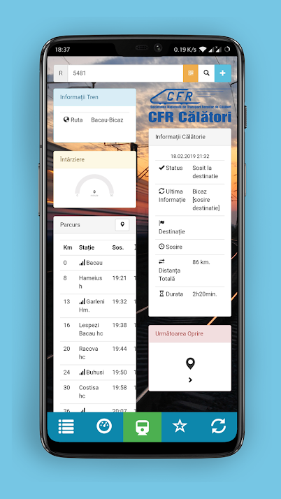
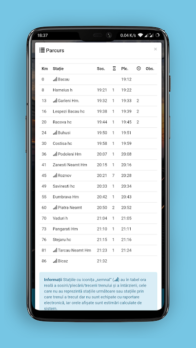
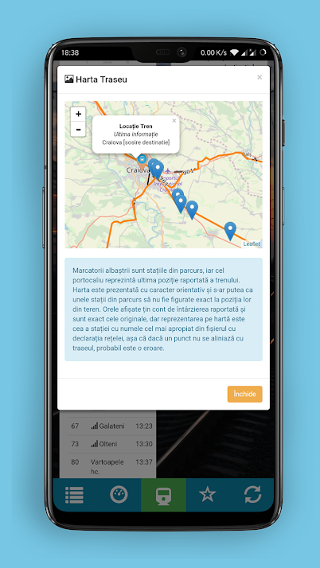

# InfoTren
Android app for scraping and parsing data from the National Romanian Railways IRIS live delay website. Includes also functions to add favourite trains, get closest station by GPS, display train stops on a map (by name-matching to database, not 100% accurate) and display GPS speed.

